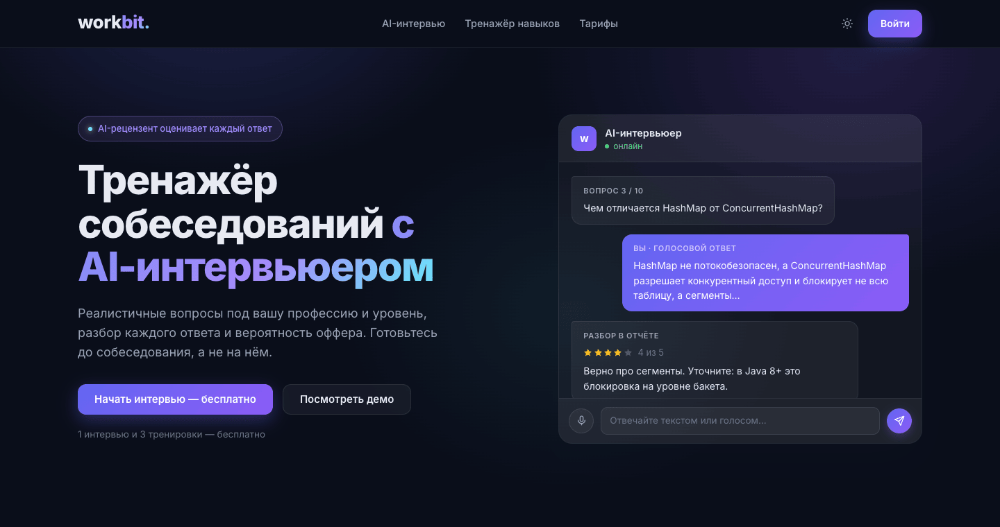
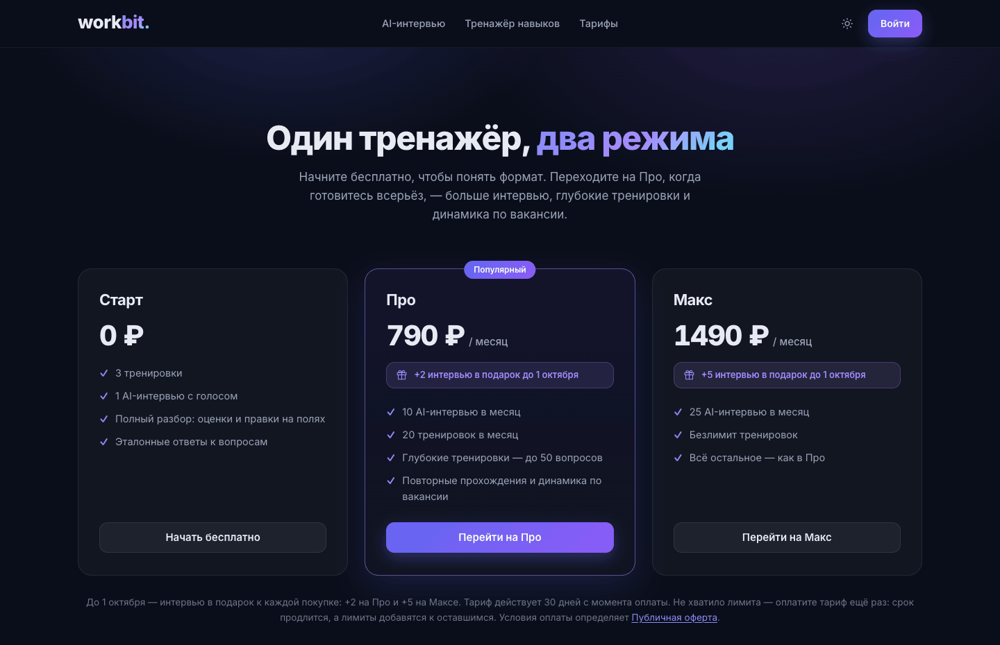
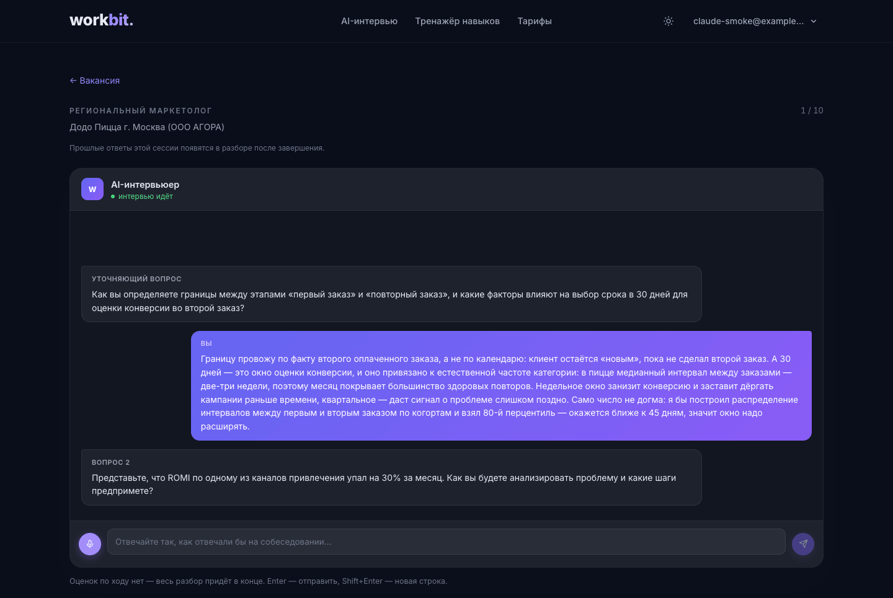
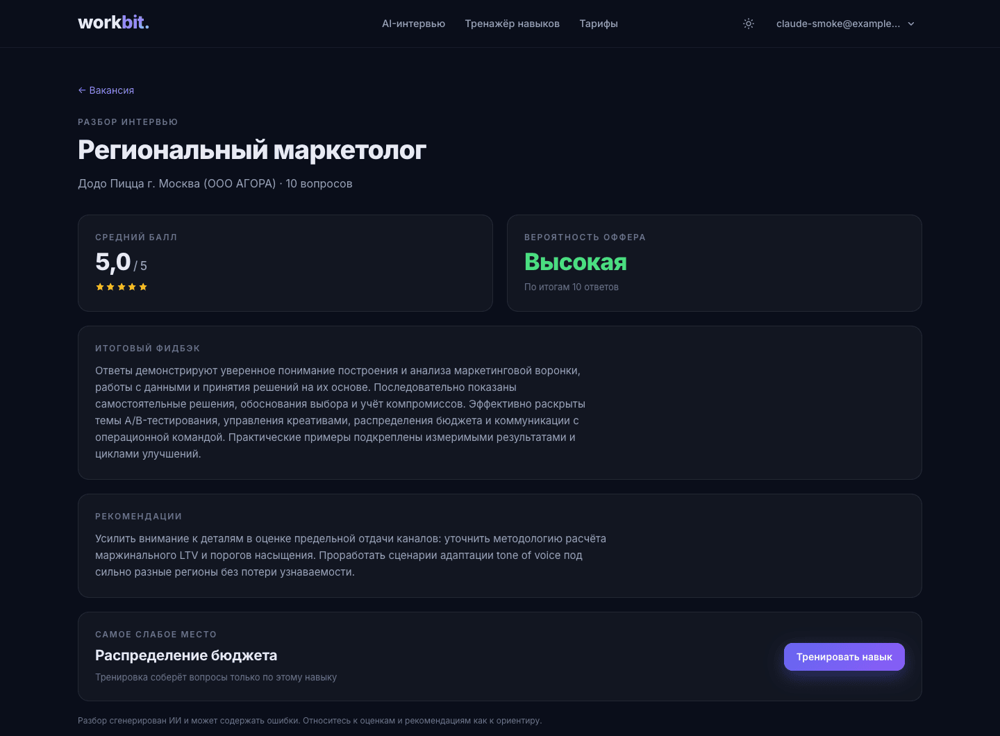
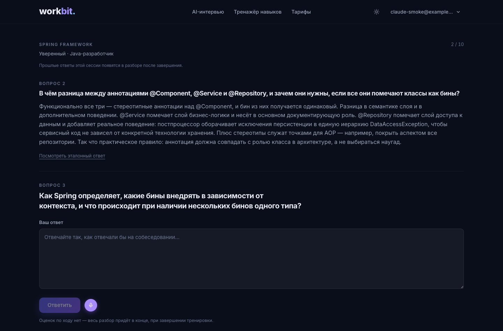
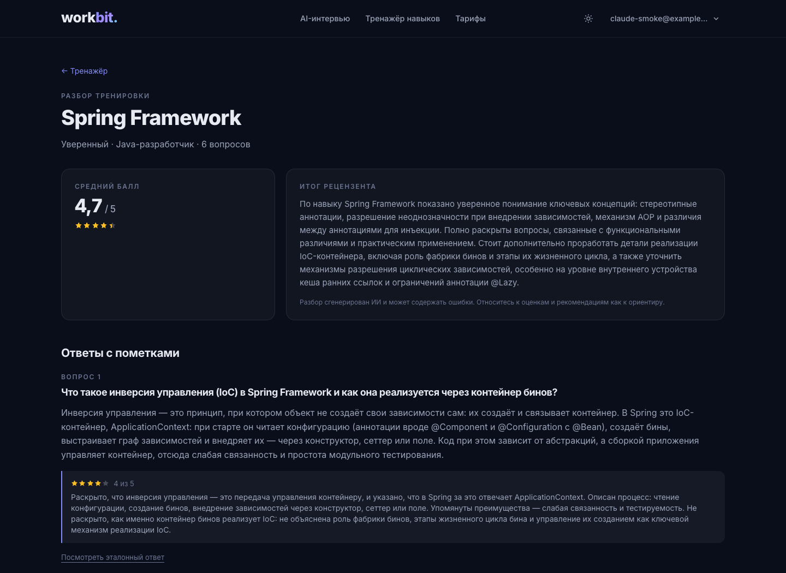
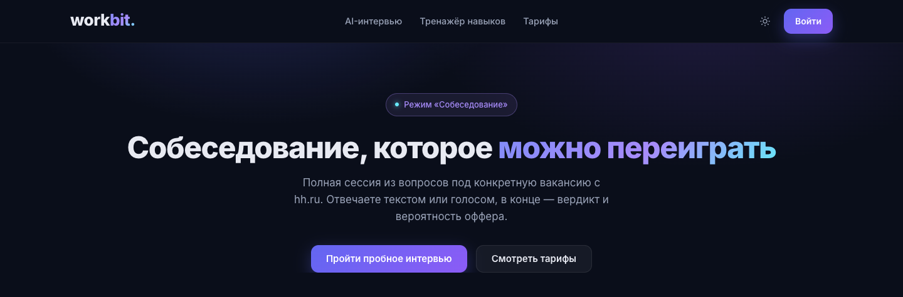
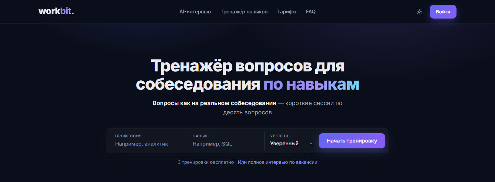
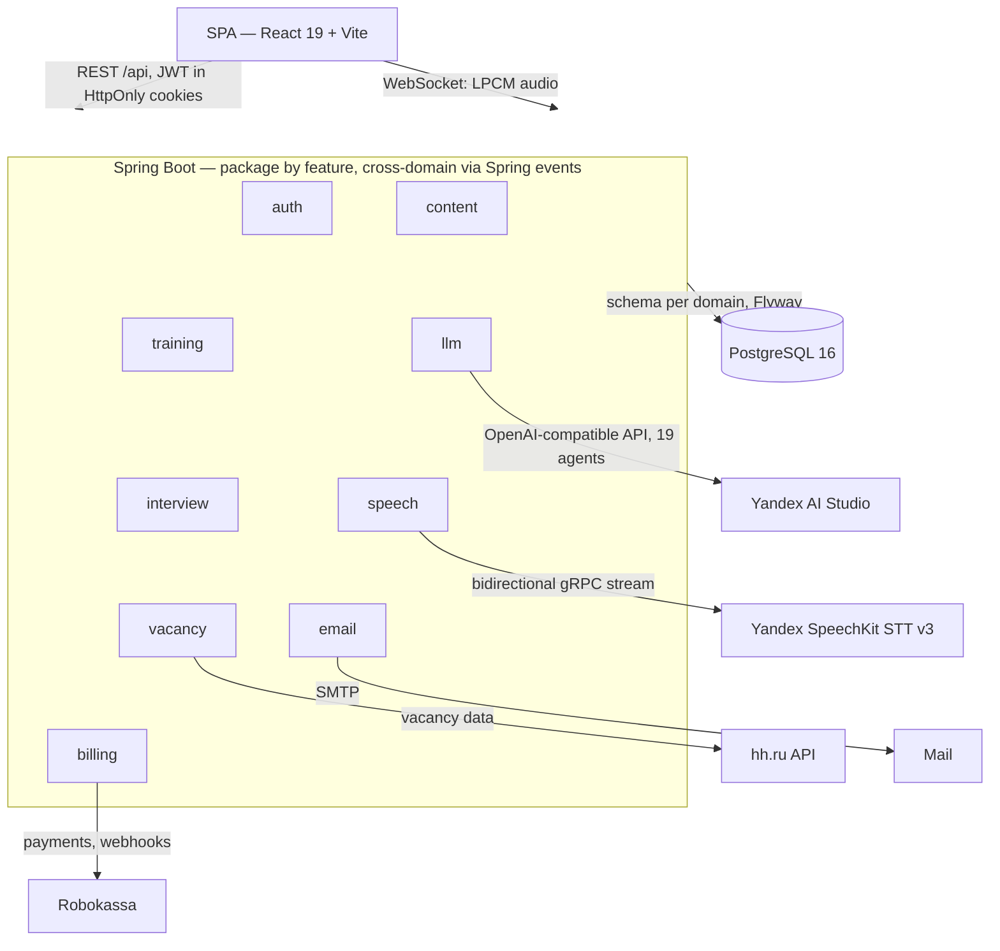
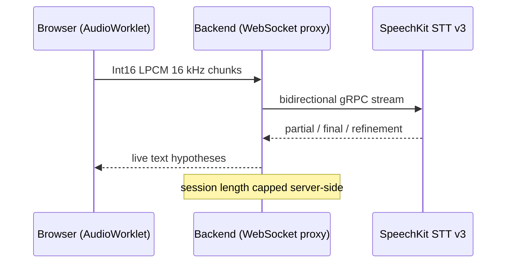

**English** | [Русский](README.ru.md)

<div align="center">

# Workbit

**AI copilot for job seekers: LLM-powered interview preparation**

Users train their skills in a "question — answer — review" format and take mock interviews
based on real hh.ru job postings, answering by text or voice.

🌐 [workbit.ru](https://workbit.ru)


</div>

---

## 📑 Table of Contents

- [Features](#-features)
- [Screenshots](#-screenshots)
- [Tech Stack](#-tech-stack)
- [Integrations](#-integrations)
- [Architecture](#-architecture)
- [Technical Highlights](#-technical-highlights)
- [Repository Structure](#-repository-structure)
- [Running Locally](#-running-locally)
- [Tests](#-tests)
- [CI/CD](#-cicd)
- [Documentation](#-documentation)
- [License](#-license)

## ✨ Features

- 🎯 **AI interview for a job posting** — paste an hh.ru vacancy link: questions are generated for the required experience level (noexp / junior / middle / senior), follow-up questions are asked along the way, and the session ends with a report: a score, offer probability, recommendations, and your weakest skill (with a shortcut to the trainer).
- 📚 **Skills trainer** — practice on a "skill + profession" pair at a chosen difficulty level: questions from a curated bank topped up by the LLM, a reference answer on demand, and a final review with a score. Free-form input is canonicalized via dictionaries and an LLM normalizer.
- 💳 **Subscription plans** — Start / Pro / Max with monthly quotas for interviews and trainings (unlimited trainings on Max); one-time payments via Robokassa, usage history in the settings.

## 📸 Screenshots

| Home — a live interview demo | Pricing — Start / Pro / Max plans |
|---|---|
|  |  |
| **AI interview — a chat over a real hh.ru vacancy** | **Interview report — score, offer probability, weakest skill** |
|  |  |
| **Skills trainer — Q&A with a reference answer on demand** | **Training report — a score and per-answer feedback** |
|  |  |
| **AI interview marketing page** | **Skills trainer marketing page** |
|  |  |

## 🧱 Tech Stack

### Backend

| Area | Technologies |
|---|---|
| Core | Java 25, Spring Boot 4 (Web, Data JPA, Security, WebSocket, Validation, Actuator, AspectJ) |
| Database | PostgreSQL 16, Flyway (schema per domain), Hibernate (`ddl-auto: validate`) |
| Security | Spring Security + JWT (JJWT), HttpOnly cookies, in-memory per-IP rate limiting |
| LLM | Yandex AI Studio via an OpenAI-compatible API (`openai-java`), 19 prompt agents |
| Speech | Yandex SpeechKit STT v3 — bidirectional gRPC streaming, stubs generated from proto at build time (`protobuf-maven-plugin`) |
| Email | Spring Mail + Thymeleaf templates, Spring domain events (AFTER_COMMIT) |
| Billing | Plan quotas with atomic debits; Robokassa one-time payments — signed URLs and webhooks (SHA-256), a per-minute reconciliation job |
| Tooling | Lombok, MapStruct, jsoup, ULID, springdoc-openapi (Swagger UI in dev) |

### Frontend

| Area | Technologies |
|---|---|
| Core | React 19, TypeScript, Vite, react-router 7 |
| Styling | Tailwind CSS v4 (CSS-first, design tokens), dark/light themes |
| Data | TanStack Query (caching, mutations, silent refresh on 401) |
| Animations | motion (`motion/react`) honoring `prefers-reduced-motion` |
| Voice | AudioWorklet → Int16 LPCM 16 kHz → WebSocket to the backend |
| Quality | oxlint, Prettier (+`prettier-plugin-tailwindcss`) |

### Testing

| Area | Technologies |
|---|---|
| Unit | JUnit 5, Mockito (`-javaagent`, JDK 25) — service layer in isolation |
| Web slice | `@WebMvcTest` + MockMvc with the real security chain |
| Persistence | Testcontainers (postgres:16) + `@DataJpaTest` on the Flyway-migrated schema |
| Email | GreenMail — real SMTP delivery and assertions on the HTML body of the email |
| E2E | `@SpringBootTest(RANDOM_PORT)` + TestRestTemplate on top of Testcontainers |
| Coverage | JaCoCo — 87% lines, 75% branches (per-domain breakdown in [Tests](#-tests)) |

### Infrastructure

| Area | Technologies |
|---|---|
| Containers | Docker, multi-service Compose (postgres + backend + caddy) |
| Proxy | Caddy — TLS, reverse proxy for `/api`, SPA static files |
| CI/CD | GitVerse CI: tests on PRs, release pipeline from `master` (kaniko image build → Yandex Container Registry, VM rollout) |
| Hosting | Yandex Cloud (VM, Container Registry), dedicated disk for PostgreSQL data |

## 🔌 Integrations

| Service | Role |
|---|---|
| **hh.ru API** | vacancy data by link for the AI interview: required experience, skills, description |
| **Yandex AI Studio** | the LLM behind question generation, follow-ups, reviews, and input normalization — 19 prompt agents |
| **Yandex SpeechKit STT v3** | streaming speech recognition for voice input |
| **Robokassa** | one-time payments for subscription plans: payment URL signing, webhook verification, lost-webhook reconciliation |
| **SMTP email** | transactional emails with the login code |

## 🏗 Architecture



A voice answer flows through a single pipeline with no intermediate files — the browser streams audio and text hypotheses come back as recognition progresses:



## 🔍 Technical Highlights

- **Package-by-feature + a DB schema per domain** — `auth`, `training`, `interview`, `vacancy`, `content`, `billing`, `llm`, `email`, `speech`; only DTOs are exposed, cross-domain communication goes through Spring events.
- **Grade-based routing of LLM agents** — the question generator, follow-up, and reviewer agents are split by candidate experience (4×3 agents), routed by the experience string from the hh API.
- **Voice input (streaming speech recognition)** — answers are dictated via Yandex SpeechKit STT v3: a browser AudioWorklet sends LPCM chunks over WebSocket, the backend proxies them into a bidirectional SpeechKit gRPC stream and returns partial/final/refinement hypotheses; session length is capped server-side.
- **Passwordless login** — email + a one-time 6-digit code, no separate sign-up; JWT tokens in HttpOnly cookies, silent refresh on 401.
- **Free-form input canonicalization** — Unicode normalization (NFKC, typographic hyphens), comparison keys built from significant words, dictionaries with upsert, and an LLM normalizer as a barrier against garbage input.
- **Privacy under Russian law (152-FZ)** — physical account deletion via DB cascades, auto-deletion of inactive accounts, user content banned from logs (`@Sensitive`, a logging aspect with MDC), an opt-out header against training models on user data.
- **Graceful LLM degradation** — a precheck for degenerate model responses, a single retry, meaningful HTTP statuses (409 "out of questions" vs 503 "AI service unavailable").
- **Idempotent payments** — the Robokassa webhook confirms a payment with a conditional `UPDATE` (concurrent retries can't double-credit), the plan is credited in the same transaction, and a per-minute reconciliation job picks up lost webhooks via the provider's status API.

## 🗂 Repository Structure

```
src/                  backend (Maven, ru.workbit:workbit)
  main/resources/db/migration/   Flyway migrations
  main/proto/                    SpeechKit STT contract
frontend/             SPA (React + Vite)
docs/                 REST contract descriptions and legal documents
.gitverse/workflows/  CI and deploy pipelines (GitVerse)
Dockerfile            backend image
docker-compose.yml    local development (postgres)
compose.prod.yml      production: postgres + backend + caddy
Caddyfile             reverse proxy config
```

## 🚀 Running Locally

Requirements: JDK 25, Node.js 22+, Docker.

1. **Database**

   ```sh
   docker compose up -d postgres
   ```

2. **Backend** (`dev` profile, port 8080)

   ```sh
   ./mvnw spring-boot:run -Dspring-boot.run.profiles=dev
   ```

   Environment variables are required (the full list lives in `application.yml`): without the Yandex keys, question generation and voice input don't work; without the SMTP password, login code emails don't arrive.

3. **Frontend** (port 5173)

   ```sh
   npm install --prefix frontend
   npm run dev --prefix frontend
   ```

   Open exactly `http://localhost:5173` (the backend's dev CORS allows only this origin). Swagger UI in dev: `http://localhost:8080/swagger-ui.html`.

## 🧪 Tests

```sh
./mvnw test     # unit tests (*Test)
./mvnw verify   # + integration tests (*IT): Testcontainers, requires Docker
```

Frontend: `npm run lint`, `npm test` (Vitest) and `npm run build`.

Coverage — JaCoCo on `./mvnw verify`: 87% lines, 75% branches (generated SpeechKit gRPC stubs are excluded from the report):

<details>
<summary>Per-domain breakdown</summary>

| Domain | Lines | % |
|---|---|---:|
| `email` | `██████████` | 100% |
| `billing` | `██████████` | 99% |
| `interview` | `██████████` | 98% |
| `auth` | `██████████` | 97% |
| `training` | `██████████` | 97% |
| `security` | `█████████░` | 93% |
| `util` | `█████████░` | 92% |
| `llm` | `█████████░` | 91% |
| `exception` | `████████░░` | 78% |
| `vacancy` | `████░░░░░░` | 35% |
| `speech` | `██░░░░░░░░` | 19% |
| **total** | `█████████░` | **87%** |

</details>

The weakly covered `vacancy` and `speech` are thin wrappers around external APIs (hh.ru and the SpeechKit gRPC stream) — they are exercised against the live services rather than by unit tests.

## ⚙️ CI/CD

- **CI** ([`.gitverse/workflows/ci.yml`](.gitverse/workflows/ci.yml)) — on PRs to `develop` and `master`: unit tests (`./mvnw test`), frontend lint and build.
- **Deploy** ([`.gitverse/workflows/deploy.yml`](.gitverse/workflows/deploy.yml)) — on push to `master`: unit tests, backend image build with kaniko and push to Yandex Container Registry, rollout to the VM ([`compose.prod.yml`](compose.prod.yml): postgres + backend + caddy; TLS and frontend static files served by Caddy) with automatic rollback and smoke tests. The weekly security scan (Trivy, npm audit) is still pending its port from the GitHub Actions era.

## 📚 Documentation

REST contracts (human-readable API descriptions, in Russian):

- [Authentication](docs/auth-api.md) — code-based login, refresh, logout, account deletion
- [Skills trainer](docs/training-api.md) — sessions, questions, dictionary suggestions, report
- [AI interview](docs/interview-api.md) — vacancy-based sessions, follow-ups, report, per-vacancy aggregation
- [Billing](docs/billing-api.md) — plan quotas, usage history, Robokassa payments
- [Speech recognition](docs/speech-api.md) — the STT WebSocket protocol

Legal documents (in Russian; the frontend renders them at `/privacy`, `/user-agreement`, `/offer`, these files are the single source of the text):

- [Privacy policy](docs/privacy-policy.md)
- [User agreement](docs/user-agreement.md)
- [Public offer](docs/offer.md)

## 📄 License

Proprietary. The source code is published for review purposes only — see [LICENSE](LICENSE).
