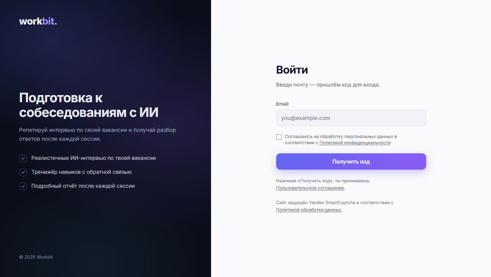
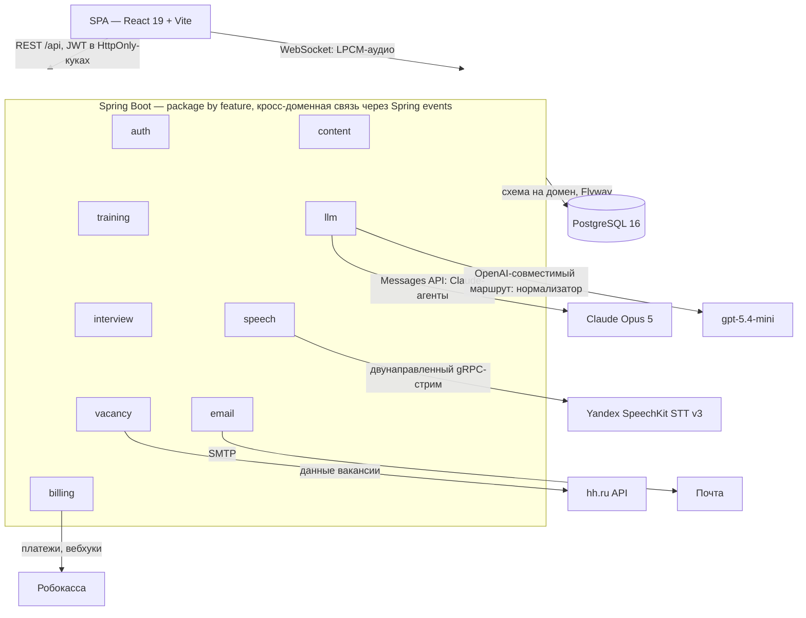
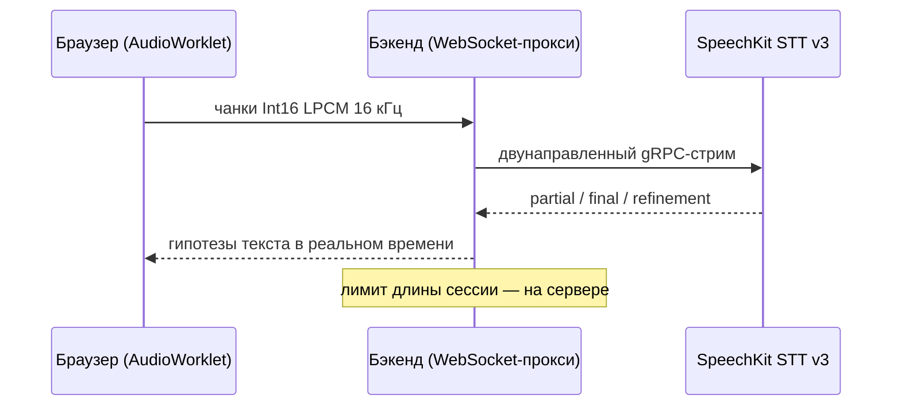

[English](README.md) | **Русский**

<div align="center">

# Workbit

**AI-копайлот соискателя: подготовка к собеседованиям на базе LLM**

Пользователь тренирует навыки в формате «вопрос — ответ — разбор» и проходит пробные интервью
по реальным вакансиям hh.ru, отвечая текстом или голосом.

🌐 [workbit.ru](https://workbit.ru)


</div>

---

## 📑 Оглавление

- [Возможности](#-возможности)
- [Скриншоты](#-скриншоты)
- [Стек](#-стек)
- [Архитектура](#-архитектура)
- [Технические особенности](#-технические-особенности)
- [Структура репозитория](#-структура-репозитория)
- [Локальный запуск](#-локальный-запуск)
- [Тесты](#-тесты)
- [CI/CD](#-cicd)
- [Документация](#-документация)
- [Лицензия](#-лицензия)

## ✨ Возможности

- 🎯 **AI-интервью по вакансии** — вставьте ссылку на вакансию hh.ru: интервьюер (Claude) составляет план под неё и ведёт адаптивную беседу, где каждый вопрос зависит от предыдущих ответов. В конце — отчёт с оценкой, вероятностью оффера, рекомендациями и самым слабым навыком (с переходом в тренажёр).
- 📚 **Тренажёр навыков** — тренировка по паре «навык + профессия» на выбранном уровне сложности: вопросы из банка с добором от LLM, эталонный ответ по кнопке, итоговый разбор с оценкой. Свободный ввод канонизируется словарями и LLM-нормализатором.
- 💳 **Подписка и квоты** — тарифы Старт / Про / Макс с месячными квотами на интервью и тренировки (на Максе тренировки безлимитны); разовая оплата через Робокассу, история операций в настройках.

## 📸 Скриншоты

| Главная — живое демо интервью | Беспарольный вход — почта и одноразовый код |
|---|---|
|  |  |
| **AI-интервью — чат по реальной вакансии hh.ru** | **Разбор интервью — балл, вероятность оффера, слабый навык** |
|  |  |
| **Тренажёр — вопрос-ответ с эталоном по кнопке** | **Разбор тренировки — оценка и фидбэк по каждому ответу** |
|  |  |
| **Маркетинговая страница AI-интервью** | **Маркетинговая страница тренажёра** |
|  |  |

## 🧱 Стек

### Бэкенд

| Область | Технологии |
|---|---|
| Ядро | Java 25, Spring Boot 4 (Web, Data JPA, Security, WebSocket, Validation, Actuator, AspectJ) |
| БД | PostgreSQL 16, Flyway (схема на домен), Hibernate (`ddl-auto: validate`) |
| Безопасность | Spring Security + JWT (JJWT), HttpOnly-куки, in-memory rate limiting per-IP |
| LLM | Claude Opus 5 через Messages API (`anthropic-java`) для промптов-агентов, gpt-5.4-mini через OpenAI-совместимый маршрут (`openai-java`) для нормализатора ввода |
| Речь | Yandex SpeechKit STT v3 — двунаправленный gRPC-стрим, стабы из proto при сборке (`protobuf-maven-plugin`) |
| Почта | Spring Mail + Thymeleaf-шаблоны, доменные события Spring (AFTER_COMMIT) |
| Биллинг | Квоты тарифов с атомарными списаниями; разовые платежи Робокассы — подписанные URL и вебхуки (SHA-256), минутная джоба сверки |
| Инструменты | Lombok, MapStruct, jsoup, ULID, springdoc-openapi (Swagger UI в dev) |

### Фронтенд

| Область | Технологии |
|---|---|
| Ядро | React 19, TypeScript, Vite, react-router 7 |
| Стили | Tailwind CSS v4 (CSS-first, дизайн-токены), тёмная/светлая темы |
| Данные | TanStack Query (кэш, мутации, silent refresh на 401) |
| Анимации | motion (`motion/react`) с уважением к `prefers-reduced-motion` |
| Голос | AudioWorklet → Int16 LPCM 16 кГц → WebSocket на бэкенд |
| Качество | oxlint, Prettier (+`prettier-plugin-tailwindcss`) |

### Тестирование

| Область | Технологии |
|---|---|
| Юнит | JUnit 5, Mockito (`-javaagent`, JDK 25) — service-слой в изоляции |
| Web-срез | `@WebMvcTest` + MockMvc с реальной security-цепочкой |
| Персистентность | Testcontainers (postgres:16) + `@DataJpaTest` на схеме из миграций Flyway |
| Почта | GreenMail — реальная SMTP-доставка и проверка HTML-тела письма |
| E2E | `@SpringBootTest(RANDOM_PORT)` + TestRestTemplate поверх Testcontainers |

### Инфраструктура

| Область | Технологии |
|---|---|
| Контейнеры | Docker, многосервисный Compose (postgres + backend + caddy) |
| Прокси | Caddy — TLS, reverse proxy `/api`, статика SPA |
| CI/CD | GitHub Actions: тесты на PR, релизный пайплайн с `master` (сборка образа → Yandex Container Registry, выкладка на VM с автооткатом), еженедельный security-скан, ночной бэкап БД, canary-проверки |
| Хостинг | Yandex Cloud (VM, Container Registry), отдельный диск под данные PostgreSQL |


## 🏗 Архитектура



Голосовой ответ проходит один поток без промежуточных файлов — браузер стримит аудио, а гипотезы текста возвращаются по мере распознавания:



## 🔍 Технические особенности

- **Package-by-feature + схема БД на домен** — `auth`, `training`, `interview`, `vacancy`, `content`, `billing`, `llm`, `email`, `speech`; наружу только DTO, кросс-доменная связь через Spring events.
- **Адаптивное интервью на Claude** — модель составляет план под вакансию, затем на каждом ходу по всей истории сама выбирает шаг (вопрос, уточнение, переспрос, завершение); правила и лимиты держит код, диалог хранится в БД. Промпт, вакансия и хвост истории кэшируются, оплачивается только прирост хода; сами промпты живут в SOPS-репозитории секретов и расшифровываются при деплое.
- **Беспарольный вход** — email + одноразовый 6-значный код из письма, отдельной регистрации нет; JWT-токены в HttpOnly-куках, silent refresh на 401.
- **Канонизация свободного ввода** — Unicode-нормализация (NFKC, типографские дефисы), ключи сравнения по значащим словам, словари с upsert и LLM-нормализатор как барьер против мусорного ввода.
- **Приватность по 152-ФЗ** — физическое удаление аккаунта каскадами БД, автоудаление неактивных, запрет пользовательского контента в логах (`@Sensitive`, аспект логирования с MDC), LLM-провайдеру уходят только обезличенные тексты ответов.
- **Плавная деградация LLM** — прекчек вырожденных ответов модели, запасной разбор structured output, обёрнутого в markdown-ограду, один повторный вызов, расширенные ретраи SDK на мигания шлюза, осмысленные HTTP-статусы (409 «вопросы кончились» vs 503 «AI-сервис недоступен»).
- **Идемпотентные платежи** — вебхук Робокассы подтверждает платёж условным `UPDATE` (конкурентные ретраи не задваивают начисление), тариф начисляется в той же транзакции, а потерянные вебхуки добирает минутная джоба сверки через статусный API провайдера.

## 🗂 Структура репозитория

```
src/                  бэкенд (Maven, ru.workbit:workbit)
  main/resources/db/migration/   миграции Flyway
  main/proto/                    контракт SpeechKit STT
  main/resources/llm/            промпты агентов (не в git — расшифровываются из репозитория секретов)
frontend/             SPA (React + Vite)
docs/                 описания REST-контрактов и юридические документы
.github/workflows/    CI, деплой, security-скан, бэкапы, canary (GitHub Actions)
Dockerfile            образ бэкенда
docker-compose.yml    локальная разработка (postgres)
compose.prod.yml      прод: postgres + backend + caddy
Caddyfile             конфиг reverse proxy
```

## 🚀 Локальный запуск

Требования: JDK 25, Node.js 22+, Docker.

1. **База данных**

   ```sh
   docker compose up -d postgres
   ```

2. **Бэкенд** (профиль `dev`, порт 8080)

   ```sh
   ./mvnw spring-boot:run -Dspring-boot.run.profiles=dev
   ```

   Нужны переменные окружения (список — в `application.yml`): без URL и токена LLM-шлюза не работают интервью и тренажёр, без ключа Yandex — голосовой ввод, без SMTP-пароля не приходит код входа. Промпты агентов в git не лежат: положите их в каталог, на который указывает `LLM_PROMPTS_DIR`.

3. **Фронтенд** (порт 5173)

   ```sh
   npm install --prefix frontend
   npm run dev --prefix frontend
   ```

   Открывать строго `http://localhost:5173` (dev-CORS бэкенда разрешает только этот origin). Swagger UI в dev: `http://localhost:8080/swagger-ui.html`.

## 🧪 Тесты

```sh
./mvnw test     # юнит-тесты (*Test)
./mvnw verify   # + интеграционные (*IT): Testcontainers, нужен Docker
```

Фронтенд: `npm run lint`, `npm test` (Vitest) и `npm run build`.

Покрытие — JaCoCo на `./mvnw verify`: 87% строк, 76% веток (сгенерированные gRPC-стабы SpeechKit из отчёта исключены):

<details>
<summary>Разбивка по доменам</summary>

| Домен | Строки | % |
|---|---|---:|
| `content` | `██████████` | 100% |
| `email` | `██████████` | 100% |
| `billing` | `██████████` | 99% |
| `interview` | `██████████` | 98% |
| `auth` | `██████████` | 98% |
| `training` | `██████████` | 97% |
| `security` | `█████████░` | 94% |
| `util` | `█████████░` | 91% |
| `llm` | `█████████░` | 87% |
| `exception` | `████████░░` | 82% |
| `vacancy` | `███░░░░░░░` | 31% |
| `speech` | `██░░░░░░░░` | 19% |
| **итого** | `█████████░` | **87%** |

</details>

Слабо покрытые `vacancy` и `speech` — тонкие обвязки внешних API (hh.ru и gRPC-стрим SpeechKit): они проверяются на живых сервисах, а не юнитами.

## ⚙️ CI/CD

- **CI** ([`ci.yml`](.github/workflows/ci.yml)) — на PR в `develop` и `master`: `mvn verify` (юнит-тесты и интеграционные на Testcontainers), сборка образа бэкенда без публикации, линт, тесты и сборка фронтенда; джоба `changes` запускает джобы бэкенда и фронтенда только при изменении их путей.
- **Deploy** ([`deploy.yml`](.github/workflows/deploy.yml)) — на push в `master` (кроме правок только фронтенда и документации): тесты, образ бэкенда в Yandex Container Registry, выкладка на VM по SSH ([`compose.prod.yml`](compose.prod.yml)) с дампом БД перед обновлением и автооткатом на предыдущий образ, если не прошёл smoke; затем авторизованный smoke с живым вызовом LLM, тег версии и release notes, обратное слияние `master` в `develop` и следующая snapshot-версия.
- **Deploy frontend** ([`deploy-frontend.yml`](.github/workflows/deploy-frontend.yml)) — на push в `master`, задевший только фронтенд или юридические документы в `docs/`: линт, тесты и сборка, preflight-проверка, что бэкенд на проде соответствует `HEAD`, rsync `dist` на VM, smoke и обратное слияние выкаченного коммита в `develop`. Push, задевший ещё и бэкенд-пути, оставляется полному Deploy.
- **Security scan** ([`security.yml`](.github/workflows/security.yml)) — еженедельно: Trivy по зависимостям репозитория и по собранному образу бэкенда (CRITICAL/HIGH, только исправимые) плюс `npm audit` для фронтенда.
- **DB backup** ([`backup.yml`](.github/workflows/backup.yml)) — ночной `pg_dump -Fc` на VM с ротацией за 14 дней.
- **Ветки и релизы** — правила работы с `master`/`develop`, хотфиксами и настройки репозитория, на которые опирается пайплайн: [`CONTRIBUTING.md`](CONTRIBUTING.md).
- **Canary** ([`canary.yml`](.github/workflows/canary.yml)) — каждые три часа: главная страница и `/api/v1/auth/me` (ожидается 401), с повторами; раз в сутки — тот же авторизованный smoke с живым вызовом LLM.

## 📚 Документация

REST-контракты (человекочитаемые описания API):

- [Аутентификация](docs/auth-api.md) — вход по коду, refresh, logout, удаление аккаунта
- [Тренажёр навыков](docs/training-api.md) — сессии, вопросы, подсказки словарей, отчёт
- [AI-интервью](docs/interview-api.md) — адаптивный диалог по вакансии, отчёт, агрегация по вакансиям
- [Биллинг](docs/billing-api.md) — квоты тарифов, история операций, оплата через Робокассу
- [Распознавание речи](docs/speech-api.md) — WebSocket-протокол STT

Юридические документы (фронтенд рендерит их на `/privacy`, `/user-agreement`, `/offer`; источник текста — только эти файлы):

- [Политика конфиденциальности](docs/privacy-policy.md)
- [Пользовательское соглашение](docs/user-agreement.md)
- [Оферта](docs/offer.md)

## 📄 Лицензия

Проприетарная. Исходный код опубликован исключительно в ознакомительных целях — см. [LICENSE](LICENSE).
